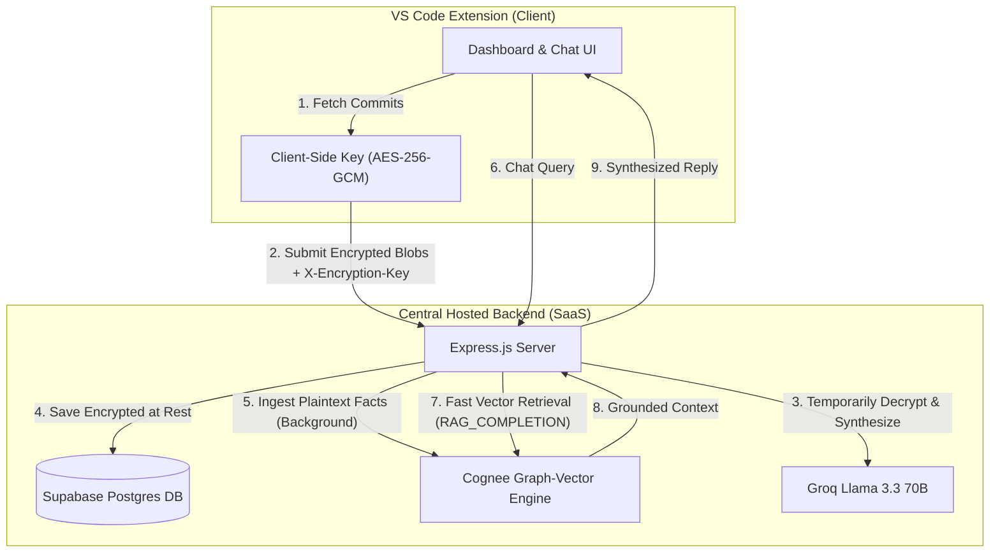

# LogMyCode v2: Hybrid Graph-Vector Memory & Semantic Commit Logger

LogMyCode v2 is an intelligent developer work-logging platform, daily update synthesizer, and semantic memory assistant. Built as a TypeScript monorepo, it combines a **VS Code extension** and a **node/Express backend** to track your development history, generate product-ready daily updates, and index your work into a semantic memory graph.

---

## 🚀 About the Project

LogMyCode v2 solves a common developer pain point: writing clear daily updates (for standups, Slack, or Jira) and recalling context about previous modifications. 

### Core Features:
*   **🔒 Zero-Knowledge SaaS (E2E Encrypted):** Generates a client-side 256-bit encryption key stored in VS Code and synchronized via Settings Sync. Commit messages, diffs, and summaries are encrypted using **AES-256-GCM** before hitting the database, ensuring zero visibility of your code at rest.
*   **🤖 Semantic Commit Pre-Processor (SCPP):** Translates raw, noisy git commit logs (e.g. `"wip"`, `"fix"`) into rich semantic descriptions and action summaries using **Groq Llama 3.3 70B**.
*   **🕸️ Cognee Graph-Vector Memory:** Ingests commit facts into a semantic memory graph powered by **Cognee**. This creates a queryable memory of your project's development history.
*   **💬 VS Code Memory Assistant:** A chat window inside VS Code where you can query your codebase timeline (e.g., *"What did I optimize in the database pooling setup last week?"*).
*   **📝 High-Level Executive Summaries:** Translates technical changelogs into clear, non-technical daily summaries suitable for product managers and stakeholders.

---

## 🛠️ Tech Stack & Architecture

### Technology Stack:
*   **Frontend/Extension:** VS Code Extensibility APIs, HTML5/CSS3 (Premium Glassmorphism styling), Vanilla JavaScript
*   **Backend Server:** Node.js, Express, TypeScript, JWT Auth
*   **Databases:** Supabase PostgreSQL (Production direct connection) with local SQLite fallback
*   **Semantic Graph & RAG:** Cognee Graph-Vector engine (Hosted tenant / Local Docker)
*   **LLM Inference:** Groq Cloud (Llama 3.3 70B Versatile) & Gemini API

### System Architecture:



---

## 🏁 Guide to Login and Test (Demo Mode)

For hackathon judges and evaluators, we have seeded a fully populated sandbox database directly on our Supabase instance so that you can evaluate the platform instantly without needing to scan local repositories.

### Step 1: Launch the Extension
1. Open the repository root in VS Code.
2. Install dependencies:
   ```bash
   pnpm install
   ```
3. Press **F5** (or go to the **Run and Debug** panel on the left sidebar and click **Run Extension**).
4. A new VS Code window titled `[Extension Development Host]` will launch.

### Step 2: Open the Dashboard
1. In the `[Extension Development Host]` window, open any folder (you can open this project folder itself).
2. Open the VS Code Command Palette:
   * **macOS:** `Cmd+Shift+P`
   * **Windows/Linux:** `Ctrl+Shift+P`
3. Type and select: **`LogMyCode: Show Dashboard`**.
4. The login overlay will appear.

### Step 3: Login as Judge
1. Click the **Login as Judge (Demo Mode)** button on the overlay.
2. A secure passcode input box will slide down from the top of VS Code.
3. Enter the passcode provided in project description in the google form
4. The dashboard will authenticate, close the overlay, and pre-populate your workspace with three mock repositories:
   * `EventsPlug-Frontend`
   * `EventsPlug-Backend`
   * `EventsPlug-Docs`

### Step 4: Scan and Summarize
1. Select the current date on the dashboard.
2. Click **Scan Commits**.
   * The extension will instantly load 4 pre-seeded mock commits representing frontend UI work, backend database optimizations, and specifications.
3. Click **Generate Summary**.
   * In less than 2 seconds (bypassing SCPP through database caching), a synthesized, product-manager-friendly Daily Summary of the progress will render on your screen.

### Step 5: Chat with the Memory Assistant
1. Open the **Memory Assistant** tab on the navigation bar.
2. In the **Target Project Context** dropdown, select `EventsPlug-Backend` or `EventsPlug-Frontend`.
3. Type a query in the chat input to query the indexed commits:
   * `"What database changes did I make this week?"`
   * `"How is attendee registration validation handled?"`
   * `"What was done to Prisma's connection limits?"`
4. Press Enter. The assistant will perform a fast vector similarity RAG search and return a grounded, clear Markdown answer.